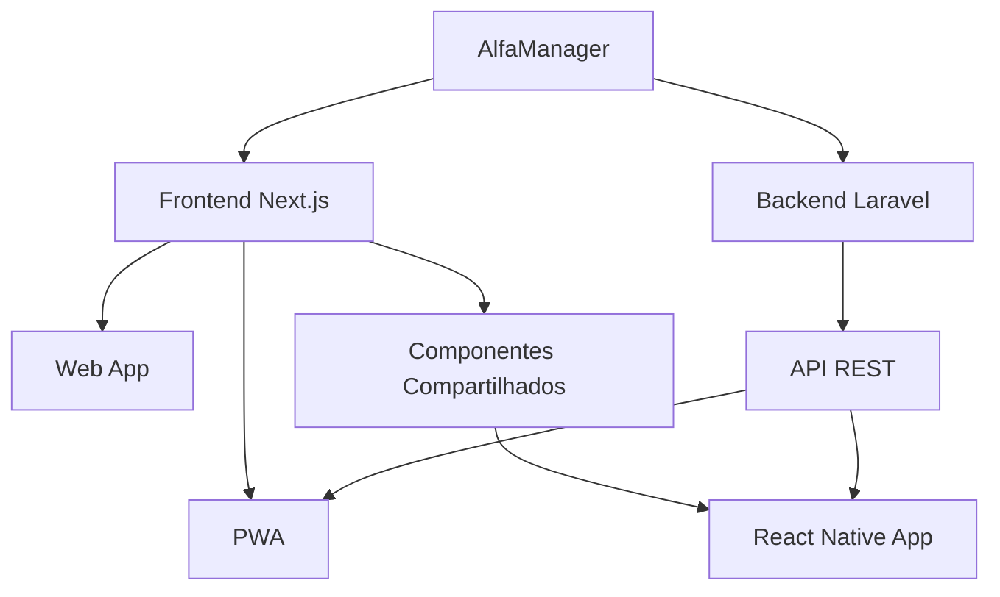
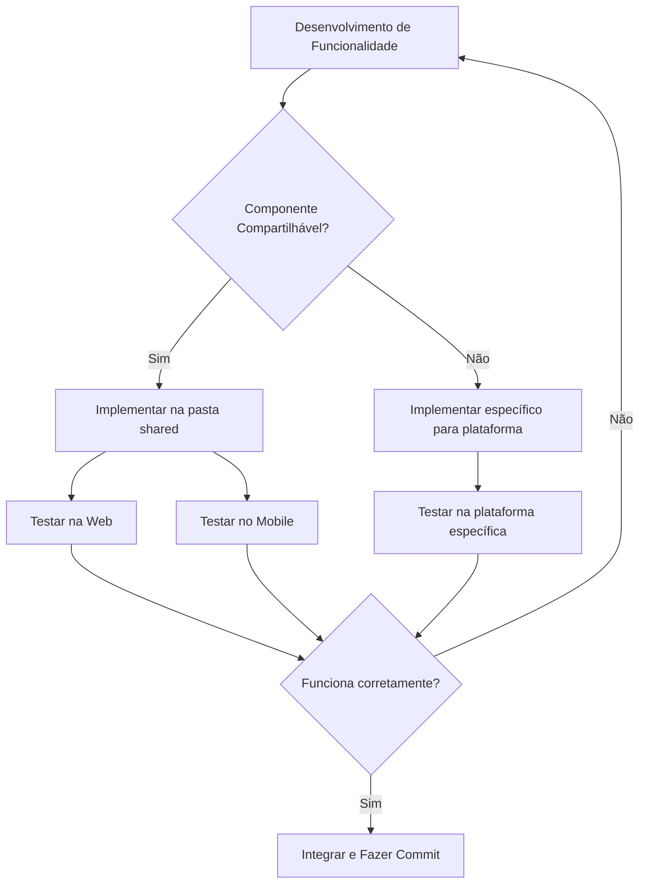

# Documentação da Implementação de Aplicativo Mobile AlfaManager

## Índice

1. [Visão Geral](#visão-geral)
2. [Arquitetura](#arquitetura)
3. [Configuração do Ambiente](#configuração-do-ambiente)
4. [PWA (Progressive Web App)](#pwa-progressive-web-app)
5. [Aplicativo Nativo com React Native](#aplicativo-nativo-com-react-native)
6. [Componentes Compartilhados](#componentes-compartilhados)
7. [Autenticação e Segurança](#autenticação-e-segurança)
8. [APIs e Comunicação](#apis-e-comunicação)
9. [Fluxo de Desenvolvimento](#fluxo-de-desenvolvimento)
10. [Boas Práticas](#boas-práticas)
11. [Publicação e Distribuição](#publicação-e-distribuição)

## Visão Geral

O AlfaManager Mobile é uma extensão da plataforma web AlfaManager, permitindo acesso às funcionalidades principais do sistema através de dispositivos móveis. A solução utiliza uma abordagem híbrida, combinando PWA (Progressive Web App) e componentes compartilhados com React Native para oferecer uma experiência consistente entre plataformas, maximizando a reutilização de código.



## Arquitetura

A arquitetura do AlfaManager Mobile segue uma abordagem de código compartilhado entre plataformas:

1. **Core da Aplicação**:

   - Lógica de negócio compartilhada
   - Estado global (Zustand)
   - Validações (Zod)
   - Utilitários e formatadores

2. **Interface do Usuário**:

   - Componentes de UI adaptáveis (design responsivo)
   - Biblioteca de componentes compartilhados
   - Temas consistentes entre plataformas

3. **Comunicação com Backend**:
   - API REST Laravel
   - Autenticação JWT
   - Chamadas assíncronas e cache

## Configuração do Ambiente

### Dependências Globais

```bash
# Instalação do Node.js (recomendado v18+)
# Instalação do Yarn ou NPM

# Ferramentas de desenvolvimento
npm install -g expo-cli
```

### Estrutura de Diretórios

```
alfamanager/
├── frontend/               # Aplicação Next.js
│   ├── app/                # Rotas e páginas
│   ├── components/         # Componentes UI
│   ├── shared/             # Código compartilhado
│   │   ├── core/           # Lógica de negócio compartilhada
│   │   ├── hooks/          # Hooks personalizados
│   │   └── utils/          # Funções utilitárias
│   └── public/             # Ativos estáticos e PWA
│       ├── manifest.json   # Configuração do PWA
│       └── sw.js           # Service Worker
├── mobile/                 # Aplicação React Native
│   ├── src/                # Código fonte
│   │   ├── screens/        # Telas da aplicação
│   │   ├── navigation/     # Configuração de navegação
│   │   └── components/     # Componentes específicos mobile
│   └── assets/             # Recursos específicos mobile
└── backend/                # API Laravel
    └── app/                # Backend Laravel existente
```

## PWA (Progressive Web App)

### Configuração do PWA

1. **Instalação do next-pwa**:

```bash
cd frontend
npm install next-pwa
```

2. **Configuração do next.config.js**:

```javascript
const withPWA = require("next-pwa")({
  dest: "public",
  register: true,
  skipWaiting: true,
  disable: process.env.NODE_ENV === "development",
});

module.exports = withPWA({
  // Configurações existentes do Next.js
});
```

3. **Criação do manifest.json**:

```json
{
  "name": "AlfaManager",
  "short_name": "AlfaManager",
  "description": "Sistema de gestão empresarial completo",
  "start_url": "/",
  "display": "standalone",
  "background_color": "#ffffff",
  "theme_color": "#0f172a",
  "icons": [
    {
      "src": "/icons/icon-192x192.png",
      "sizes": "192x192",
      "type": "image/png"
    },
    {
      "src": "/icons/icon-512x512.png",
      "sizes": "512x512",
      "type": "image/png"
    }
  ]
}
```

4. **Otimizações para Mobile**:

- Adicionar meta tags adequadas no `layout.tsx`:

```jsx
export default function RootLayout({ children }) {
  return (
    <html lang="pt-BR">
      <head>
        <meta
          name="viewport"
          content="width=device-width, initial-scale=1, maximum-scale=1, user-scalable=no"
        />
        <meta name="theme-color" content="#0f172a" />
        <meta name="apple-mobile-web-app-capable" content="yes" />
        <meta
          name="apple-mobile-web-app-status-bar-style"
          content="black-translucent"
        />
        <link rel="manifest" href="/manifest.json" />
        <link rel="apple-touch-icon" href="/icons/icon-192x192.png" />
      </head>
      <body>{children}</body>
    </html>
  );
}
```

## Aplicativo Nativo com React Native

### Configuração Inicial

1. **Criação do projeto React Native**:

```bash
npx create-expo-app alfa-manager-mobile
cd alfa-manager-mobile
```

2. **Instalação de dependências**:

```bash
npm install react-native-web react-native-screens react-native-safe-area-context
npm install @react-navigation/native @react-navigation/stack
npm install zustand axios react-hook-form zod
npm install --save-dev @types/react-native
```

3. **Configuração do babel.config.js para aliases**:

```javascript
module.exports = function (api) {
  api.cache(true);
  return {
    presets: ["babel-preset-expo"],
    plugins: [
      [
        "module-resolver",
        {
          alias: {
            "@shared": "../frontend/shared",
            "@components": "./src/components",
            "@screens": "./src/screens",
            "@navigation": "./src/navigation",
            "@utils": "./src/utils",
            "@hooks": "./src/hooks",
          },
        },
      ],
    ],
  };
};
```

### Estrutura de Navegação

```jsx
// src/navigation/index.tsx
import React from "react";
import { NavigationContainer } from "@react-navigation/native";
import { createStackNavigator } from "@react-navigation/stack";

import LoginScreen from "@screens/LoginScreen";
import DashboardScreen from "@screens/DashboardScreen";
import ProductsScreen from "@screens/ProductsScreen";
import SettingsScreen from "@screens/SettingsScreen";

const Stack = createStackNavigator();

export default function AppNavigation() {
  const isAuthenticated = useAuthStore((state) => state.isAuthenticated);

  return (
    <NavigationContainer>
      <Stack.Navigator>
        {!isAuthenticated ? (
          <Stack.Screen
            name="Login"
            component={LoginScreen}
            options={{ headerShown: false }}
          />
        ) : (
          <>
            <Stack.Screen name="Dashboard" component={DashboardScreen} />
            <Stack.Screen name="Products" component={ProductsScreen} />
            <Stack.Screen name="Settings" component={SettingsScreen} />
          </>
        )}
      </Stack.Navigator>
    </NavigationContainer>
  );
}
```

## Componentes Compartilhados

### Criação da Estrutura Compartilhada

1. **Organização da pasta `shared`**:

```
frontend/shared/
├── components/     # Componentes UI agnosticos de plataforma
├── hooks/          # Hooks customizados
├── services/       # Serviços de API
├── stores/         # Estados globais (Zustand)
├── types/          # Definições de tipos TypeScript
└── utils/          # Funções utilitárias
```

2. **Exemplo de Componente Compartilhado**:

```tsx
// frontend/shared/components/Button/Button.tsx
import React from "react";

// Tipos de propriedades compartilhados
export type ButtonProps = {
  title: string;
  onPress: () => void;
  variant?: "primary" | "secondary" | "outline";
  disabled?: boolean;
};

// Versão Web
export const Button = ({
  title,
  onPress,
  variant = "primary",
  disabled,
}: ButtonProps) => {
  // Implementação para Web usando classes Tailwind
  return (
    <button
      onClick={onPress}
      disabled={disabled}
      className={`px-4 py-2 rounded-md ${
        variant === "primary"
          ? "bg-blue-600 text-white"
          : variant === "secondary"
          ? "bg-gray-500 text-white"
          : "border border-blue-600 text-blue-600"
      } ${disabled ? "opacity-50 cursor-not-allowed" : ""}`}
    >
      {title}
    </button>
  );
};

// Exportação default para uso na web
export default Button;
```

```tsx
// mobile/src/components/Button/Button.tsx
import { Pressable, Text, StyleSheet } from "react-native";
// Importando tipos da versão compartilhada
import { ButtonProps } from "@shared/components/Button/Button";

// Implementação para React Native
export const Button = ({
  title,
  onPress,
  variant = "primary",
  disabled,
}: ButtonProps) => {
  return (
    <Pressable
      onPress={onPress}
      disabled={disabled}
      style={({ pressed }) => [
        styles.button,
        styles[variant],
        pressed && styles.pressed,
        disabled && styles.disabled,
      ]}
    >
      <Text style={[styles.text, styles[`${variant}Text`]]}>{title}</Text>
    </Pressable>
  );
};

const styles = StyleSheet.create({
  button: {
    paddingHorizontal: 16,
    paddingVertical: 8,
    borderRadius: 6,
  },
  primary: {
    backgroundColor: "#2563eb",
  },
  secondary: {
    backgroundColor: "#6b7280",
  },
  outline: {
    backgroundColor: "transparent",
    borderWidth: 1,
    borderColor: "#2563eb",
  },
  primaryText: {
    color: "#ffffff",
  },
  secondaryText: {
    color: "#ffffff",
  },
  outlineText: {
    color: "#2563eb",
  },
  pressed: {
    opacity: 0.8,
  },
  disabled: {
    opacity: 0.5,
  },
  text: {
    fontWeight: "500",
    textAlign: "center",
  },
});

export default Button;
```

## Autenticação e Segurança

### Implementação de Autenticação

1. **Store de Autenticação Compartilhada**:

```tsx
// frontend/shared/stores/authStore.ts
import { create } from "zustand";
import { persist } from "zustand/middleware";
import jwt_decode from "jwt-decode";
import { AuthService } from "../services/AuthService";

type User = {
  id: number;
  name: string;
  email: string;
};

type AuthState = {
  token: string | null;
  user: User | null;
  isAuthenticated: boolean;
  loading: boolean;
  error: string | null;
  login: (email: string, password: string) => Promise<void>;
  logout: () => void;
  getToken: () => string | null;
  checkAuth: () => boolean;
};

// Criação da store usando Zustand
export const useAuthStore = create<AuthState>()(
  persist(
    (set, get) => ({
      token: null,
      user: null,
      isAuthenticated: false,
      loading: false,
      error: null,

      login: async (email: string, password: string) => {
        set({ loading: true, error: null });
        try {
          const response = await AuthService.login(email, password);
          const { token } = response;
          const user = jwt_decode<User>(token);

          set({
            token,
            user,
            isAuthenticated: true,
            loading: false,
          });
        } catch (error) {
          set({
            error: "Falha na autenticação",
            loading: false,
            isAuthenticated: false,
          });
        }
      },

      logout: () => {
        set({
          token: null,
          user: null,
          isAuthenticated: false,
        });
      },

      getToken: () => get().token,

      checkAuth: () => {
        const { token } = get();
        if (!token) return false;

        try {
          const decoded: any = jwt_decode(token);
          // Verificar se o token expirou
          const currentTime = Date.now() / 1000;
          return decoded.exp > currentTime;
        } catch (error) {
          return false;
        }
      },
    }),
    {
      name: "auth-storage",
      // Adaptadores de armazenamento específicos para cada plataforma
      // serão implementados na inicialização do app
    },
  ),
);
```

2. **Serviço de API Compartilhado**:

```tsx
// frontend/shared/services/api.ts
import axios, { AxiosInstance, AxiosRequestConfig } from "axios";
import { useAuthStore } from "../stores/authStore";

// Função de criação de cliente API
export const createApiClient = (baseURL: string): AxiosInstance => {
  const api = axios.create({
    baseURL,
    timeout: 10000,
    headers: {
      "Content-Type": "application/json",
      Accept: "application/json",
    },
  });

  // Interceptor para adicionar token em cada requisição
  api.interceptors.request.use(
    (config: AxiosRequestConfig) => {
      const token = useAuthStore.getState().getToken();
      if (token && config.headers) {
        config.headers.Authorization = `Bearer ${token}`;
      }
      return config;
    },
    (error) => Promise.reject(error),
  );

  // Interceptor para tratamento de erros
  api.interceptors.response.use(
    (response) => response,
    (error) => {
      // Tratamento de erro de autenticação (401)
      if (error.response && error.response.status === 401) {
        useAuthStore.getState().logout();
      }
      return Promise.reject(error);
    },
  );

  return api;
};

// Instância padrão da API
export const apiClient = createApiClient(
  process.env.NEXT_PUBLIC_API_URL || "http://localhost:8000/api",
);
```

## APIs e Comunicação

### Serviços de API

```tsx
// frontend/shared/services/ProductService.ts
import { apiClient } from "./api";
import { Product } from "../types/Product";

export const ProductService = {
  // Buscar todos os produtos
  getProducts: async (params?: any): Promise<Product[]> => {
    const response = await apiClient.get("/products", { params });
    return response.data.data;
  },

  // Buscar produto por ID
  getProduct: async (id: number): Promise<Product> => {
    const response = await apiClient.get(`/products/${id}`);
    return response.data.data;
  },

  // Buscar produto por código de barras
  getProductByBarcode: async (barcode: string): Promise<Product | null> => {
    try {
      const response = await apiClient.get(`/products/barcode/${barcode}`);
      return response.data.data;
    } catch (error) {
      if (error.response && error.response.status === 404) {
        return null;
      }
      throw error;
    }
  },

  // Criar novo produto
  createProduct: async (product: Partial<Product>): Promise<Product> => {
    const response = await apiClient.post("/products", product);
    return response.data.data;
  },

  // Atualizar produto existente
  updateProduct: async (
    id: number,
    product: Partial<Product>,
  ): Promise<Product> => {
    const response = await apiClient.put(`/products/${id}`, product);
    return response.data.data;
  },

  // Excluir produto
  deleteProduct: async (id: number): Promise<void> => {
    await apiClient.delete(`/products/${id}`);
  },
};
```

## Fluxo de Desenvolvimento

### Desenvolvimento Paralelo

1. **Iniciando o Desenvolvimento**:

```bash
# Terminal 1: Desenvolvimento Web/PWA
cd frontend
npm run dev

# Terminal 2: Desenvolvimento Mobile
cd mobile
npm start
```

2. **Processo de desenvolvimento**:



## Boas Práticas

### Otimização de Performance

1. **Lazy Loading e Code Splitting**:

   - Utilizar importações dinâmicas no Next.js
   - Separar código por rotas

2. **Otimização de Imagens**:

   - Usar `next/image` no frontend web
   - Utilizar formatos otimizados (WebP, AVIF)

3. **Estado Global**:

   - Minimizar estado global
   - Usar selectors para evitar re-renderizações

4. **Cache e Armazenamento**:
   - Implementar cache de API com React Query
   - Utilizar armazenamento local para dados frequentes

### Acessibilidade

1. **Contraste e Legibilidade**:

   - Garantir contraste adequado
   - Tamanhos de fonte legíveis em dispositivos móveis

2. **Suporte a Gestos**:
   - Implementar áreas de toque adequadas para mobile
   - Suporte a gestos comuns (swipe, pinch)

## Publicação e Distribuição

### Publicação do PWA

1. **Build de Produção**:

```bash
cd frontend
npm run build
```

2. **Verificação do PWA**:
   - Utilizar Lighthouse para verificar conformidade
   - Testar instalação em dispositivos reais

### Publicação do App Nativo

1. **Geração de Builds**:

```bash
cd mobile
eas build --platform android
eas build --platform ios
```

2. **Distribuição**:
   - Google Play Store para Android
   - Apple App Store para iOS
   - TestFlight/Firebase App Distribution para testes

### CI/CD

```yaml
# .github/workflows/deploy.yml
name: Deploy AlfaManager
on:
  push:
    branches: [main]
jobs:
  deploy-web:
    runs-on: ubuntu-latest
    steps:
      - uses: actions/checkout@v3
      - uses: actions/setup-node@v3
        with:
          node-version: "18"
      - name: Install dependencies
        run: cd frontend && npm ci
      - name: Build
        run: cd frontend && npm run build
      - name: Deploy
        # Deploy steps para seu provedor de hospedagem

  build-mobile:
    runs-on: ubuntu-latest
    steps:
      - uses: actions/checkout@v3
      - uses: actions/setup-node@v3
        with:
          node-version: "18"
      - name: Setup Expo
        uses: expo/expo-github-action@v8
        with:
          expo-version: latest
          eas-version: latest
          token: ${{ secrets.EXPO_TOKEN }}
      - name: Install dependencies
        run: cd mobile && npm ci
      - name: Build Android
        run: cd mobile && eas build --platform android --non-interactive
```

---

Esta documentação fornece um guia completo para a implementação da versão mobile do AlfaManager, aproveitando o código existente e as melhores práticas de desenvolvimento cross-platform. A abordagem combinada de PWA e React Native oferece o melhor dos dois mundos: rápida implementação via PWA e experiência nativa quando necessário.
