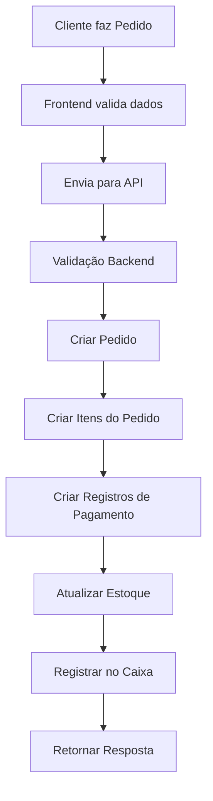
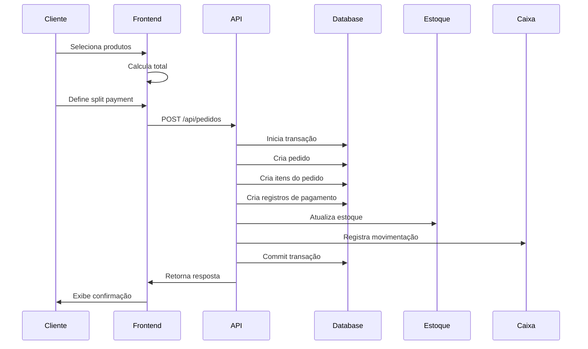

# Sistema de Pedidos com Split Payment - Documentação

## Índice
1. [Visão Geral](#visão-geral)
2. [Fluxo do Sistema](#fluxo-do-sistema)
3. [Entidades](#entidades)
4. [API Endpoints](#api-endpoints)
5. [Exemplos de Uso](#exemplos-de-uso)

## Visão Geral

O sistema permite a criação de pedidos com múltiplas formas de pagamento (split payment), mantendo o controle de estoque, comissões e caixa.



## Fluxo do Sistema

### 1. Processo de Venda


## Entidades

### 1. Pedido (pedidos)
```sql
CREATE TABLE pedidos (
    id bigint PRIMARY KEY,
    cliente_id bigint,
    type varchar(255),
    total decimal(10,2),
    desconto decimal(10,2),
    status varchar(255),
    created_at timestamp,
    updated_at timestamp
);
```

### 2. Pagamentos do Pedido (pedidos_pagamentos)
```sql
CREATE TABLE pedidos_pagamentos (
    id bigint PRIMARY KEY,
    pedido_id bigint,
    payment_method varchar(255),
    amount decimal(10,2),
    status varchar(255),
    transaction_details json,
    created_at timestamp,
    updated_at timestamp
);
```

### 3. Itens do Pedido (pedidos_produtos)
```sql
CREATE TABLE pedidos_produtos (
    id bigint PRIMARY KEY,
    pedido_id bigint,
    produto_id bigint,
    quantidade int,
    preco_unitario decimal(10,2),
    vendedor_id bigint,
    created_at timestamp,
    updated_at timestamp
);
```

## API Endpoints

### Criar Pedido

**Endpoint:** `POST /api/pedidos`

**Request Body:**
```json
{
    "cliente_id": 1,
    "type": "VENDA",
    "desconto": 10.00,
    "produtos": [
        {
            "produto_id": 1,
            "quantidade": 2,
            "vendedor_id": 1,
            "variante_id": null
        }
    ],
    "payment_splits": [
        {
            "method": "CREDIT_CARD",
            "amount": 45.00
        },
        {
            "method": "MONEY",
            "amount": 45.00
        }
    ]
}
```

**Response Success (200):**
```json
{
    "data": {
        "id": 1,
        "cliente_id": 1,
        "type": "VENDA",
        "total": 100.00,
        "desconto": 10.00,
        "status": "pending",
        "created_at": "2025-04-21T16:24:15-03:00",
        "updated_at": "2025-04-21T16:24:15-03:00",
        "pagamentos": [
            {
                "id": 1,
                "pedido_id": 1,
                "payment_method": "CREDIT_CARD",
                "amount": 45.00,
                "status": "pending"
            },
            {
                "id": 2,
                "pedido_id": 1,
                "payment_method": "MONEY",
                "amount": 45.00,
                "status": "pending"
            }
        ],
        "produtos": [
            {
                "id": 1,
                "produto_id": 1,
                "quantidade": 2,
                "preco_unitario": 50.00,
                "vendedor_id": 1
            }
        ]
    }
}
```

**Response Error (422):**
```json
{
    "message": "The given data was invalid.",
    "errors": {
        "payment_splits": [
            "A soma dos pagamentos deve ser igual ao total do pedido"
        ]
    }
}
```

### Atualizar Status do Pagamento

**Endpoint:** `PATCH /api/pedidos/{pedidoId}/payments/{paymentId}`

**Request Body:**
```json
{
    "status": "completed"
}
```

**Response Success (200):**
```json
{
    "message": "Payment updated successfully",
    "data": {
        "status": "completed",
        "pedido_status": "completed"
    }
}
```

## Estados e Transições

### Estados do Pedido
- `pending`: Pedido criado, aguardando confirmação dos pagamentos
- `processing`: Pagamentos confirmados, processando
- `completed`: Pedido finalizado com sucesso
- `cancelled`: Pedido cancelado

### Estados do Pagamento
- `pending`: Aguardando processamento
- `processing`: Em processamento
- `completed`: Pagamento confirmado
- `failed`: Falha no pagamento
- `refunded`: Pagamento estornado

## Validações

1. **Pedido**
   - Total dos pagamentos deve ser igual ao total do pedido menos desconto
   - Cliente deve existir
   - Produtos devem existir e ter estoque disponível

2. **Pagamentos**
   - Método de pagamento deve ser válido
   - Valor deve ser maior que zero
   - Soma dos valores deve bater com total do pedido

3. **Produtos**
   - Quantidade deve ser maior que zero
   - Produto deve existir
   - Vendedor deve existir (se especificado)

## Fluxo de Processamento

1. **Recebimento do Pedido**
   - Validação dos dados
   - Início da transação

2. **Criação do Pedido**
   - Registro do pedido
   - Registro dos itens
   - Registro dos pagamentos

3. **Processamento**
   - Atualização do estoque
   - Registro no caixa (se pagamento à vista)
   - Geração de comissões

4. **Finalização**
   - Commit da transação
   - Retorno da resposta

## Considerações de Segurança

1. **Transações**
   - Todas as operações são executadas em transação
   - Rollback automático em caso de erro

2. **Validações**
   - Validação de entrada de dados
   - Verificação de permissões
   - Sanitização de dados

3. **Logs**
   - Log de todas as operações
   - Rastreamento de erros

## Exemplos de Implementação

### Validação de Request (Laravel)

```php
class StorePedidoRequest extends FormRequest
{
    public function rules()
    {
        return [
            'cliente_id' => 'required|exists:clientes,id',
            'type' => 'required|string',
            'desconto' => 'required|numeric|min:0',
            'produtos' => 'required|array|min:1',
            'produtos.*.produto_id' => 'required|exists:produtos,id',
            'produtos.*.quantidade' => 'required|integer|min:1',
            'produtos.*.vendedor_id' => 'nullable|exists:users,id',
            'payment_splits' => 'required|array|min:1',
            'payment_splits.*.method' => 'required|string|in:MONEY,CREDIT_CARD,DEBIT_CARD,PIX',
            'payment_splits.*.amount' => 'required|numeric|min:0.01',
        ];
    }

    public function withValidator($validator)
    {
        $validator->after(function ($validator) {
            $this->validatePaymentTotal($validator);
        });
    }

    protected function validatePaymentTotal($validator)
    {
        $total = collect($this->produtos)->sum(function ($item) {
            return $item['quantidade'] * $this->getProdutoPreco($item['produto_id']);
        });
        
        $totalPayments = collect($this->payment_splits)->sum('amount');
        $expectedTotal = $total - $this->desconto;

        if ($totalPayments !== $expectedTotal) {
            $validator->errors()->add(
                'payment_splits',
                'A soma dos pagamentos deve ser igual ao total do pedido'
            );
        }
    }
}
```

### Controller (Laravel)

```php
class PedidosController extends Controller
{
    protected $pedidoService;

    public function __construct(PedidoService $pedidoService)
    {
        $this->pedidoService = $pedidoService;
    }

    public function store(StorePedidoRequest $request)
    {
        try {
            $pedido = $this->pedidoService->create($request->validated());
            return response()->json([
                'data' => $pedido->load('pagamentos', 'produtos')
            ]);
        } catch (\Exception $e) {
            return response()->json([
                'message' => 'Erro ao criar pedido',
                'error' => $e->getMessage()
            ], 500);
        }
    }
}
```

### Service (Laravel)

```php
class PedidoService
{
    public function create(array $data)
    {
        DB::beginTransaction();
        try {
            // Criar pedido
            $pedido = Pedido::create([
                'cliente_id' => $data['cliente_id'],
                'type' => $data['type'],
                'total' => $this->calculateTotal($data['produtos']),
                'desconto' => $data['desconto'],
                'status' => 'pending'
            ]);

            // Criar itens do pedido
            foreach ($data['produtos'] as $produto) {
                $pedido->produtos()->attach($produto['produto_id'], [
                    'quantidade' => $produto['quantidade'],
                    'preco_unitario' => $this->getProdutoPreco($produto['produto_id']),
                    'vendedor_id' => $produto['vendedor_id']
                ]);
            }

            // Criar pagamentos
            foreach ($data['payment_splits'] as $payment) {
                $pedido->pagamentos()->create([
                    'payment_method' => $payment['method'],
                    'amount' => $payment['amount'],
                    'status' => 'pending'
                ]);
            }

            DB::commit();
            return $pedido;
        } catch (\Exception $e) {
            DB::rollBack();
            throw $e;
        }
    }
}
```

Esta documentação fornece uma visão completa do sistema de pedidos com split payment. Para implementar novas funcionalidades ou fazer modificações, siga os padrões e fluxos estabelecidos aqui.
